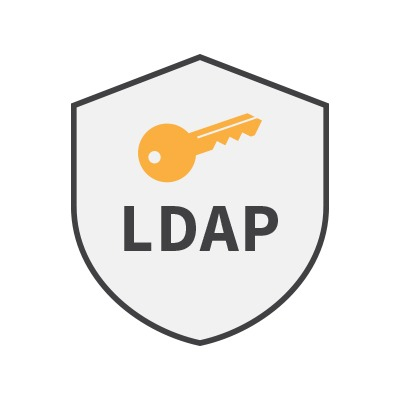

# LDAP

The Lightweight Directory Access Protocol is an open, vendor-neutral, industry standard application protocol for accessing and maintaining distributed directory information services over an Internet Protocol network.
